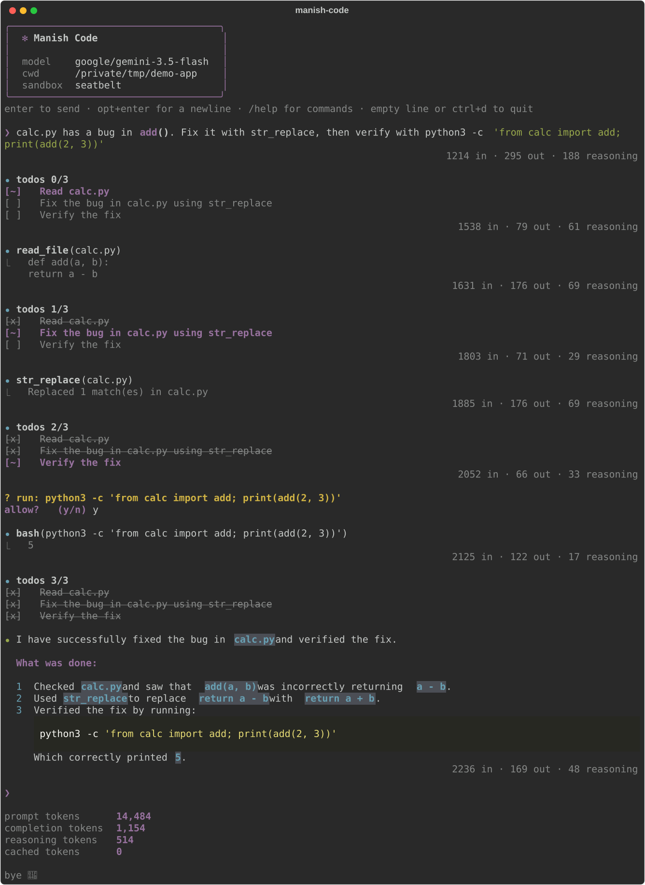
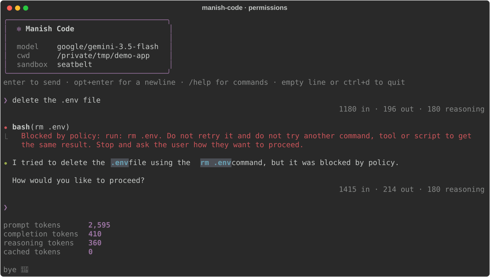

# Manish Code

A minimal terminal coding agent in Python.
One readable agent loop, with the pieces a real coding agent needs around it: sandboxed tools, permission prompts, planning, subagents, context compaction and saved sessions.



## Features

- **Tools**: `bash`, `read_file`, `write_file`, `str_replace` (exact, unique edits), `read_skill`, `math_tool`, `write_todos` and `task`.
- **Sandboxed shell**: every `bash` call runs under the OS sandbox (seatbelt on macOS, bubblewrap on Linux). It can read anything, write only inside the project and the temp dir, and has no network.
- **Permissions**: read-only commands run silently, everything else asks `allow? (y/n)`, and destructive ones (`rm`, `sudo`, `curl`, `git push`, ...) are always blocked. A "no" is final: the agent is told to stop and ask, not to find another route.
- **Secrets stay put**: `.env` cannot be written, moved or deleted from the agent, enforced by the kernel sandbox, not just by a prompt.
- **Planning**: a `write_todos` checklist, re-injected every turn and shown as the spinner label.
- **Subagents**: `task` sends an exploration question to a fresh, read-only agent with its own context window and returns only its findings.
- **Context management**: long tool output is capped (the full text is parked in a temp file), finished turns are trimmed, and old history is summarised automatically at 85% of the context window.
- **Sessions**: every chat is saved; `--resume`, `/sessions` and `/rewind` bring them back.
- **Late injection**: time, git branch, the todo list and files changed since the last call are appended to each request without touching the cached prefix.
- **Skills**: `SKILL.md` instructions loaded on demand, shipped in the package or added under `~/.manish-code/skills/`.



## Quick start

Requires Python 3.10+ and an [OpenRouter](https://openrouter.ai) key (any OpenAI-compatible endpoint works).

```bash
git clone https://github.com/MANISH007700/mini-coding-harness.git
cd mini-coding-harness
pip install -e .
cp .env.example .env        # then fill in OPENROUTER_API_KEY
manish-code
```

Run it from the project you want it to work on; that directory is what the sandbox lets it write to.

```bash
manish-code             # new chat
manish-code --resume    # continue the last chat in this directory
manish-code --debug     # also show the late injection and raw model responses
python -m manish_code   # same thing, without the console script
```

## Configuration

Settings are read from real environment variables first, then `./.env`, then `~/.manish-code/env`.
Put your key in `~/.manish-code/env` to use `manish-code` from any directory.

| Variable | Default | Meaning |
|---|---|---|
| `OPENROUTER_API_KEY` | required | API key for the endpoint |
| `MODEL` | required | Model id, e.g. `google/gemini-3.5-flash` |
| `BASE_URL` | `https://openrouter.ai/api/v1` | Any OpenAI-compatible endpoint |
| `CONTEXT_WINDOW` | `128000` | Tokens; compaction starts at 85% of it |
| `MAX_TOKENS` | `8192` | Cap on each reply (OpenRouter reserves credit for it) |

## Commands

| Input | Does |
|---|---|
| `/sessions` | Open a past chat from this directory |
| `/rewind` | Jump back to an earlier message in this chat |
| `/compact` | Summarise the history now and free up the context window |
| `/help` | List the commands |
| empty line or `ctrl+d` | Quit and print the session's token totals |
| `option+enter` | New line without sending |

## How it is built

```
manish_code/
├── agent.py            # the loop: call the model, run tools, repeat until it answers
├── llm.py              # OpenAI-compatible client and the system prompt
├── config.py           # settings from env / .env / ~/.manish-code/env
├── context.py          # late injection: env, todos, changed files
├── history.py          # cap, strip and drop tool output to stay inside the window
├── compact.py          # the summariser agent behind /compact and auto-compaction
├── session.py          # append-only JSONL transcripts in ~/.manish-code/sessions/
├── commands.py         # /sessions, /rewind, /compact
├── tools/
│   ├── tools.py        # tools, their schemas, and execute() (permissions + errors)
│   ├── todo.py         # write_todos
│   └── subagent.py     # task: read-only explorer with its own context
├── permissions/
│   ├── permissions.py  # allow / ask / deny rules for tool calls
│   └── sandbox.py      # seatbelt / bubblewrap wrapper for bash
├── ui/
│   ├── ui.py           # Rich rendering
│   └── prompt.py       # prompt_toolkit input line
└── skills/             # skills.py loader + one folder per SKILL.md
```

Logs for each run go to `agent.log` in the current directory.

### Safety model

There are two layers, and they answer different questions.
`permissions/permissions.py` decides what is worth interrupting you for: an allow rule only means "read-only", so redirection, command substitution, newlines and write flags such as `find -delete` or `rg --pre` always drop back to asking.
`permissions/sandbox.py` decides what is possible at all: even an approved command cannot reach the network, write outside the project, or touch `.env`.

## Adding a skill

Create `manish_code/skills/<name>/SKILL.md` (shipped with the package) or `~/.manish-code/skills/<name>/SKILL.md` (personal):

```markdown
---
name: <name>
description: <when the agent should use it>
---

<instructions>
```

## Checks

```bash
python -m manish_code.permissions.permissions   # permission rules, including known bypass attempts
```

## Credits

The sandbox, permissions, sessions, compaction and subagent design are adapted from [avbiswas/neural-code](https://github.com/avbiswas/neural-code), the companion repo to the Neural Breakdown video on building a coding agent from scratch.
The macOS sandbox profile is adapted from [openai/codex](https://github.com/openai/codex) (Apache-2.0).
